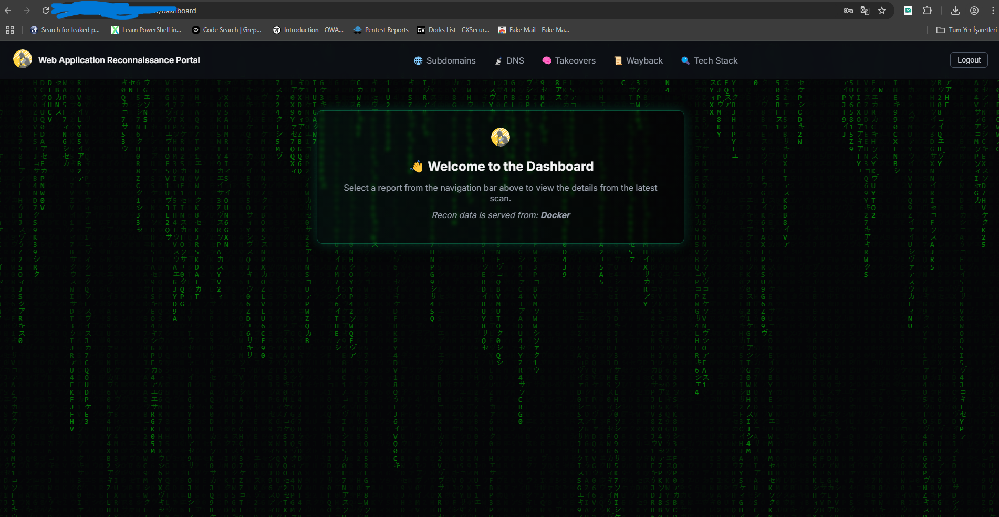
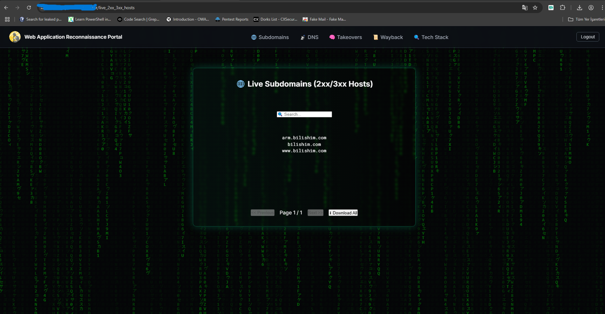
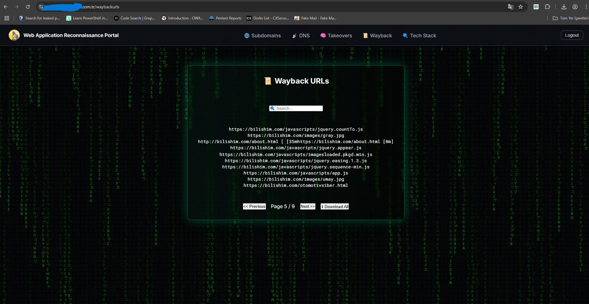

# 🔍 Recon-as-Code: Passive Web Application Reconnaissance in a CI/CD Pipeline

This project delivers a fully automated **Recon-as-Code** workflow for passive reconnaissance in web application environments. It combines GitHub Actions-based CI/CD automation, powerful recon tools, and a Flask-powered dashboard for visualized and authenticated access to the findings.

---

## 🧭 Pipeline Flow

To better understand the timeline and flow of this pipeline, you can explore the full visual representation below:

👉 **[📌 View the CI/CD Passive Recon Mindmap (Markmap)](./markmap.html)**  


---

## Example Usage:

1) **Login Page**  


2) **Dashboard Page**  


3) **Live Host Discovery Page**  


4) **DNS Records Page**  


5) **Subdomain Takeover Checking Page**  


6) **Waybackurls Records**  


7) **Tech Stack**  


---

## 🚀 Features

- Subdomain enumeration via `subfinder` and `assetfinder`
- Live host probing using `httpx` (filtered 2xx/3xx)
- Archived URL extraction via `waybackurls`
- Sensitive endpoint filtering with regex from wayback data
- Technology stack fingerprinting with `whatweb`
- DNS record enumeration using `dnsx`
- Subdomain takeover detection via `subzy`
- Optional GitHub leak detection using `github-dorks`
- HTML report generation with:
  - Pagination (10 lines/page)
  - Search/filter
  - Download `.txt` output
- Secure Flask dashboard:
  - bcrypt-hashed login
  - Session timeout after 10 minutes
  - Session heartbeat every 2 minutes
- Matrix-style animated UI with dark mode
- Custom 404 error page with themed fallback

---

## 🛠️ Technologies

- **Python (Flask)** – Web interface and session logic
- **SQLite** – Secure user credential storage
- **JavaScript** – Pagination, auth, session check, matrix animation
- **Docker** – Runtime environment
- **GitHub Actions** – CI/CD workflow execution
- **Self-hosted Runner** – Volume-mounted deployment

---

## 📦 Docker Image

> [ghcr.io/onurcangnc/kali-pentest:latest](https://github.com/onurcangnc/kali-pentest)

A lightweight, prebuilt Docker image optimized for passive recon and automation.

---

## ⚙️ CI/CD Workflow

The pipeline defined in `web_app_recon.yml`:

1. Accepts a domain input (or defaults to `bilishim.com`)
2. Cleans up previous `.txt` artifacts
3. Runs passive recon tools in parallel:
   - `subfinder`, `assetfinder`, `httpx`, `dnsx`, `subzy`, `whatweb`, `waybackurls`
4. Filters sensitive URLs from wayback results
5. Stores output as `.txt` files under `findings/`
6. Copies findings into `/output/data/`
7. Runs `generate_report.py` to create paginated `.html` reports
8. Reports become available to the authenticated Flask frontend

---

## 🔐 Authentication

- Secure login via Flask using bcrypt-hashed credentials stored in SQLite
- Sessions expire after 10 minutes of inactivity
- Session heartbeat checks every 2 minutes to auto-logout inactive users
- All pages including `/dashboard` and report routes are protected

---

## 📁 Output Files (Inside `/output/`)

- `live_2xx_3xx_hosts.html` – Subdomains with live HTTP(S) services
- `dns_info.html` – DNS record results
- `subzy_results.html` – Vulnerable subdomains
- `waybackurls.html` – Archived endpoints with download option
- `waybackurls_filtered.html` – Sensitive filtered URLs with download option
- `whatweb.html` – Technology fingerprinting results

All reports are **paginated**, searchable, and styled for readability and dark mode. `.txt` downloads available where relevant.

---

## 🧠 Architecture Overview

This system follows a **DevSecOps-aligned approach** to passive reconnaissance by integrating:

- 🧾 CI/CD-based automation via GitHub Actions
- 🧪 Recon tools for DNS, Subdomains, Tech Stack, Wayback URLs
- 📄 Report generation using Python with pagination & filtering
- 🔐 Session-controlled Flask dashboard with Matrix-themed UI

---

## 🧪 Local Setup

```bash
# 1. Install Flask and dependencies
pip install flask flask-session bcrypt

# 2. Create user database
python db.py

# 3. Run the Flask app
python app.py

# 4. Access dashboard:
http://localhost:5000
```

---

## 🌐 Reverse Proxy with NGINX

To make the Flask-based dashboard securely accessible via a domain (e.g. `https://localhost:5000`), you can configure NGINX as a reverse proxy.

This setup allows NGINX to:
- Serve the Flask app on standard HTTPS port (443)
- Handle TLS (SSL) termination
- Forward requests to the Flask app running locally on port `5000`

###  NGINX Configuration

```nginx
server {
    listen 80;
    server_name recon.example.com;

    # Redirect all HTTP to HTTPS
    return 301 https://$host$request_uri;
}

server {
    listen 443 ssl;
    server_name recon.example.com;

    ssl_certificate     /etc/ssl/certs/recon.example.com.crt;
    ssl_certificate_key /etc/ssl/private/recon.example.com.key;

    location / {
        proxy_pass         http://127.0.0.1:5000;
        proxy_http_version 1.1;
        proxy_set_header   Host              $host;
        proxy_set_header   X-Real-IP         $remote_addr;
        proxy_set_header   X-Forwarded-For   $proxy_add_x_forwarded_for;
        proxy_set_header   X-Forwarded-Proto $scheme;
    }
}
```

---

## 🤝 Contributions

- Contributions and suggestions are welcome!
- Help me to improve this passive recon CI/CD approach for modern DevSecOps pipelines.

⚠️ This project focuses solely on passive reconnaissance. No brute-force, fuzzing, or active exploitation is performed by design.

